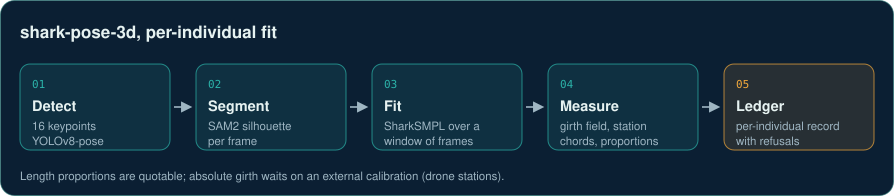

# shark-pose-3d

3D pose and body shape of free-swimming white sharks from monocular underwater video.

> **Skeleton of an ongoing project, awaiting review.** This is the real module layout,
> signatures and docstrings, with every function body replaced by `...` and all footage,
> weights and configuration left out. It does not run, but the docstrings and the outline
> below are enough to follow the method and build your own. The full code stays private
> until the work is published. You are welcome to build on the ideas; please credit
> Daniel Sambold if you do.

## Collaborate

I am looking for collaborators. What needs work:

- **Absolute girth calibration.** The fitter reads 7 to 12 % wide on a known-truth control. It needs an external width measurement: drone overflights with stations, or a physical phantom.
- **Re-identification.** No fin, pigment, scar or shape cue has cleared the pilot's bar yet across 995 videos. Ideas and matched photo-ID catalogues welcome.
- **More views of the same animal.** Paired camera angles, or footage with a known-size referent in frame.

<p>
  <a href="https://github.com/dbold23/shark-pose-3d-skeleton/issues/new?template=1-collaborate.yml"></a>
  <a href="https://github.com/dbold23/shark-pose-3d-skeleton/issues/new?template=3-share-data.yml"></a>
  <a href="mailto:daniel.sambold@gmail.com?subject=About%20shark-pose-3d"></a>
</p>

<sub>The first buttons open a short public form (needs a GitHub account). No account, or rather keep it private? Email <a href="mailto:daniel.sambold@gmail.com">daniel.sambold@gmail.com</a> or message me on <a href="https://www.linkedin.com/in/daniel-sambold-620b37221">LinkedIn</a>.</sub>



White sharks cannot be weighed, so body condition has to come from video. A 16-keypoint
pose detector and SAM2 silhouettes drive a fit of a rigged parametric shark model
(SharkSMPL: 16-joint skeleton, PCA shape space, linear blend skinning) over a window of
frames. The fit is then read as a girth field, station chords and length proportions,
with a support contract that refuses a measurement the footage cannot back.

## Where it stands

- Run over the archive: 1,011 single-window records on 250 individuals.
- Quotable per animal today: length proportions and girth-profile shape.
- Not yet quotable: absolute girth. On a known-truth control the fitter reads 7 to 12 %
  wide, and no second view or configuration removed it. Certifying it needs an external
  width measurement (drone stations or a physical phantom).
- Now (September 2026): telling individuals apart from their fins, flank pigment, scars
  and shape across 995 videos. The pre-registered pilot has not yet found a cue that
  clears its bar, and the next round is being set up.

## Build your own

1. **Keypoints and masks.** Train a 16-keypoint pose detector on your species and take
   silhouettes from SAM2 prompted by its box.
2. **A parametric body.** Rig a template mesh with a joint skeleton, learn a PCA shape
   space from a few scans or renders, and skin it linearly (`model_3d/`).
3. **Fit per individual.** Optimise one shared shape and per-frame pose over a window of
   frames against keypoint reprojection and a soft-silhouette loss, with pose, shape and
   temporal priors (`encoder/`, `losses/`).
4. **Measure, and refuse.** Read girth and chords off the fitted mesh, and only report a
   number the views in that window can actually support (`morphometrics/`).
5. **Check against truth.** Fit something of known size before quoting anything.

## Layout

| Package | What it holds |
|---|---|
| `model_3d/` | SharkSMPL: skeleton, shape and pose spaces, skinning, glTF I/O |
| `encoder/` | SPIN-style regressor, SMPLify fitting, joint per-individual fit |
| `losses/` | Keypoint, soft-silhouette, pose/shape priors, temporal and adversarial terms |
| `sim2real/`, `synthetic/` | Domain-randomised synthetic renders and proxy inputs |
| `temporal/` | Sequence smoothing across frames |
| `morphometrics/` | Girth field, deprojection, station chords, aggregation with refusal |
| `corpus/` | Which windows of the archive are trustworthy enough to fit |
| `integration/` | Bridges to the annotation platform and segmentation |
| `tests/` | The test suite's structure and test names |

```
shark_pose/
    active_learning/
    core/
    corpus/
    data/
    encoder/
    integration/
    losses/
    model_3d/
    morphometrics/
    refinement/
    sim2real/
    synthetic/
        blender/
    temporal/
tests/
```
